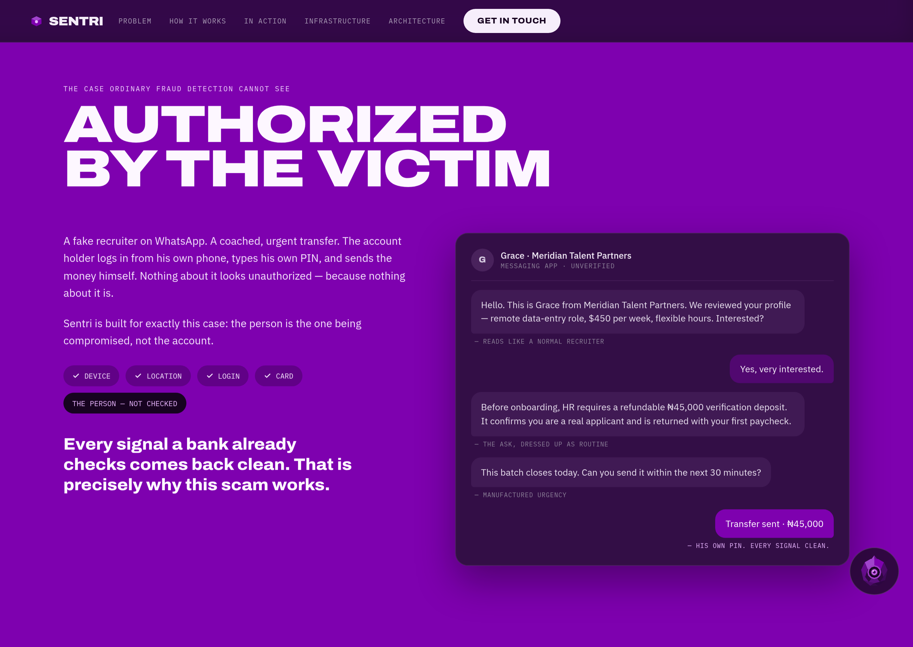
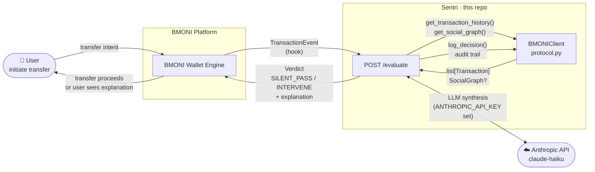
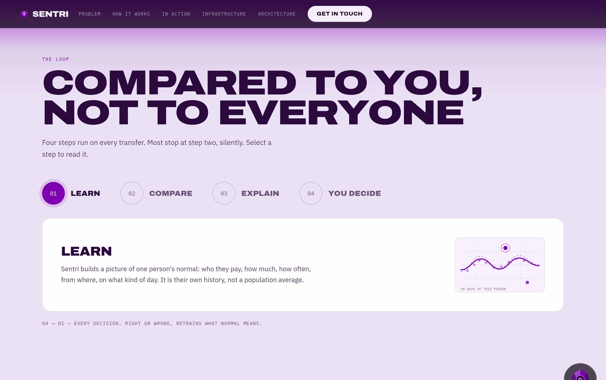
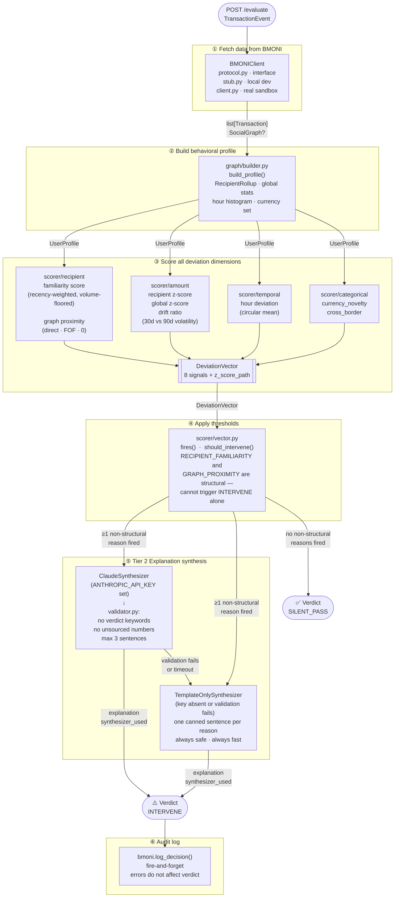
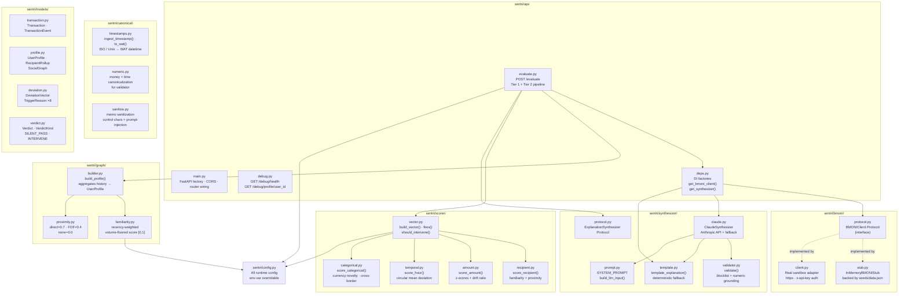
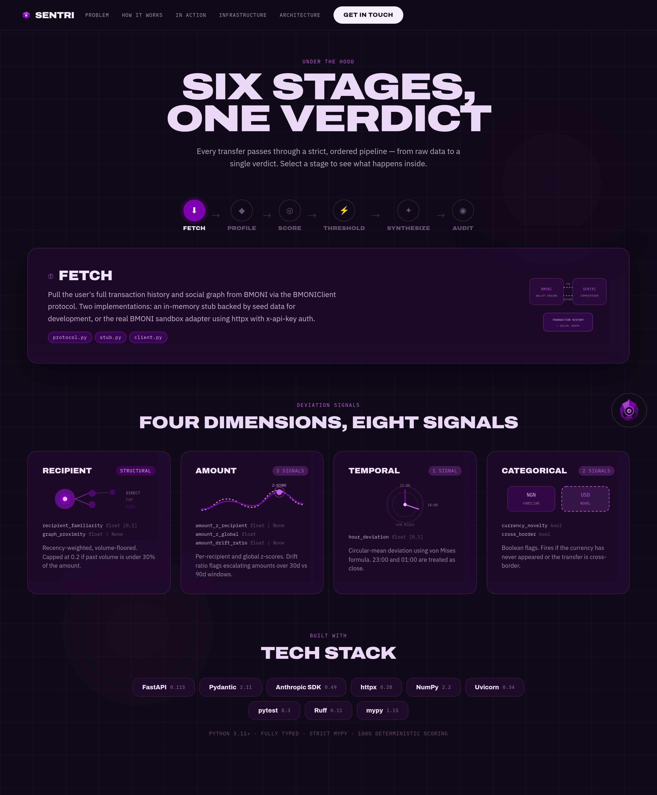
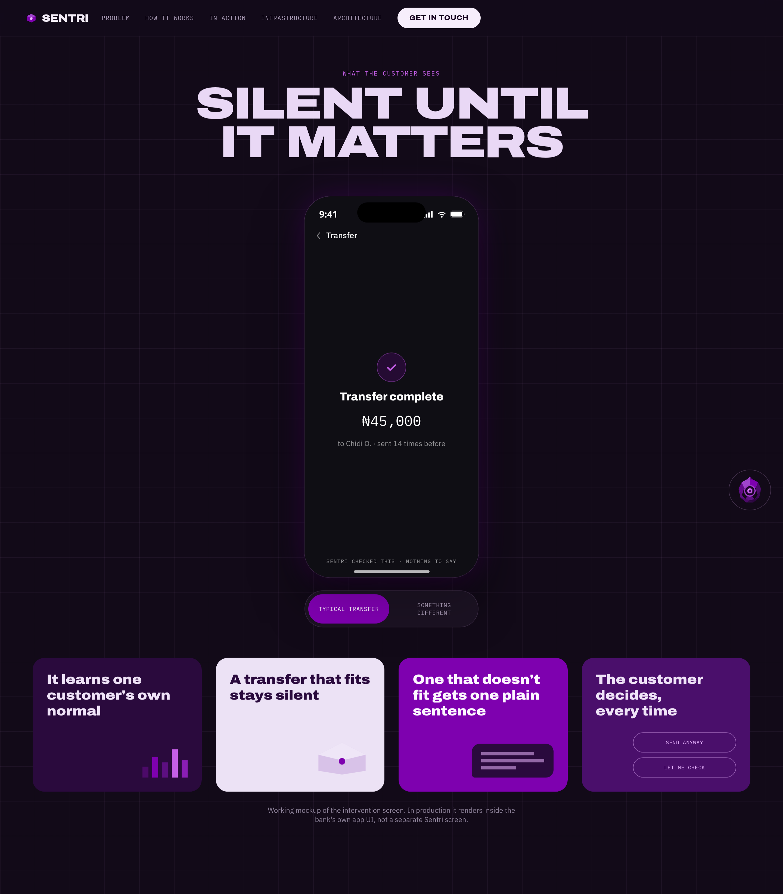
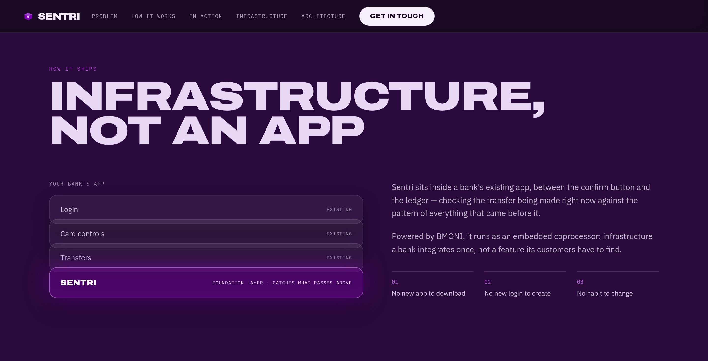

# Sentri


**Sentri is an AI security coprocessor for financial transactions.**

Before money moves, Sentri evaluates the transaction against the user's own
behavioral history, computes deterministic deviation signals, and — when
something is genuinely out of pattern — synthesizes a plain-language
explanation so the user can make an informed decision. It is not a fraud
oracle and issues no verdicts; it is a second-opinion layer that mirrors the
user's history back to them.

Sentri is designed to plug into [BMONI](https://bmoni.com)'s embedded-finance
stack, intercepting transfer intents before they are authorized.

---

## Table of Contents

- [Quickstart](#quickstart)
- [Architecture](#architecture)
  - [System overview](#system-overview)
  - [Request pipeline](#request-pipeline)
  - [Module map](#module-map)
- [Configuration](#configuration)
- [API reference](#api-reference)
  - [POST /evaluate](#post-evaluate)
  - [GET /debug/health](#get-debughealth)
  - [GET /debug/profile/{user_id}](#get-debugprofileuser_id)
- [Deviation signals](#deviation-signals)
- [Synthesizer tiers](#synthesizer-tiers)
- [BMONI integration](#bmoni-integration)
- [Seed data and local development](#seed-data-and-local-development)
- [Running tests](#running-tests)
- [Swapping in the real BMONI client](#swapping-in-the-real-bmoni-client)

---

## Quickstart

```bash
# 1. Create and activate a virtual environment (Python 3.11+)
python3.11 -m venv .venv
source .venv/bin/activate        # Windows: .venv\Scripts\activate

# 2. Install the package with dev dependencies
pip install -e ".[dev]"

# 3. Copy the environment template
cp .env.example .env
# Set ANTHROPIC_API_KEY for LLM-synthesized explanations (optional — see below)
# Set BMONI_API_KEY to use the real BMONI sandbox (optional — see below)

# 4. Generate the seed dataset (10 personas, 100+ transactions each)
python -m seeds.generator

# 5. Run the full test suite
pytest

# 6. Start the API server
uvicorn sentri.api.main:app --reload
```

Both `ANTHROPIC_API_KEY` and `BMONI_API_KEY` are **optional for local
development**. When they are absent, Sentri falls back gracefully:

| Variable | Present | Absent |
|----------|---------|--------|
| `ANTHROPIC_API_KEY` | Explanations via Claude (claude-haiku-4-5-20251001) | Explanations via deterministic template renderer |
| `BMONI_API_KEY` | Live BMONI sandbox (`https://embedded-dev.bmoni.com`) | In-memory stub backed by `seeds/data.json` |

The server must be started from the `backend/` directory (or with it
on `PYTHONPATH`) because the default stub loads `seeds/data.json` relative to
the package root.

---

## Architecture

### System overview





### Request pipeline



Every call to `POST /evaluate` passes through a strict, ordered pipeline:



### Module map



---

## Configuration

All values live in `sentri/config.py` and are overridable via environment
variables. No restart is required during development with `--reload`.

| Variable | Default | Description |
|----------|---------|-------------|
| `ANTHROPIC_API_KEY` | *(unset)* | Anthropic API key. Absent → template synthesizer. |
| `BMONI_API_KEY` | *(unset)* | BMONI sandbox key. Absent → in-memory stub. |
| `BMONI_BASE_URL` | `https://embedded-dev.bmoni.com` | BMONI sandbox base URL (path already includes `/v1`). |
| `LLM_MODEL` | `claude-haiku-4-5-20251001` | Anthropic model for Tier 2 synthesis. |
| `LLM_MAX_TOKENS` | `300` | Token budget for LLM responses. |
| `LLM_TIMEOUT_SECONDS` | `5.0` | Timeout before falling back to template. |
| `TIMEZONE` | `Africa/Lagos` | Reference timezone for hour-of-day scoring (WAT, UTC+1). |
| `FAMILIARITY_DECAY_LAMBDA` | `0.01` | Exponential decay rate for recency weighting (per day). |
| `FAMILIARITY_VOLUME_FLOOR_RATIO` | `0.3` | Familiarity is capped at 0.2 if past volume < 30% of requested amount. |
| `Z_SCORE_MIN_SAMPLES` | `3` | Minimum transactions to a recipient before using per-recipient z-score. |
| `THRESHOLDS` | *(see below)* | JSON blob overriding any/all deviation thresholds. |
| `SUPPORTED_LANGUAGES` | `en` | Comma-separated language codes (currently `en` only). |
| `DEFAULT_LANGUAGE` | `en` | Fallback language for synthesis. |
| `DEBUG_ENDPOINTS_ENABLED` | `true` | Set to `false` to 404 the `/debug/*` endpoints in production. |
| `SENTRI_SEED_PATH` | *(package root)* | Path to `data.json` when using the stub. |

Default thresholds (override any key via `THRESHOLDS='{"amount_z_above": 3.0}'`):

| Threshold key | Default | Meaning |
|--------------|---------|---------|
| `recipient_familiarity_below` | `0.15` | Fire if familiarity score < 0.15 |
| `graph_proximity_below` | `0.20` | Fire if graph proximity < 0.20 |
| `amount_z_above` | `2.5` | Fire if \|z-score\| > 2.5 |
| `hour_deviation_above` | `0.70` | Fire if circular hour deviation > 0.70 |
| `currency_novelty` | `true` | Fire if currency never seen in history |
| `cross_border` | `true` | Fire if `cross_border: true` in request |

---

## API reference

### POST /evaluate

Evaluate a pending transaction against the user's behavioral profile.

**Request body** (`TransactionEvent`):

```json
{
  "user_id":       "string",
  "amount_kobo":   123456789,
  "timestamp":     "2027-06-01T11:00:00+01:00",
  "recipient_id":  "string (1-128 chars: letters, digits, _ - : .)",
  "currency":      "NGN",
  "cross_border":  false,
  "device_id":     "string | null",
  "memo":          "string | null  (max 200 chars, sanitized)",
  "language":      "en | null"
}
```

`timestamp` accepts either an ISO 8601 string (timezone-aware) or a positive
Unix integer timestamp.

**Response** (`Verdict`):

```json
{
  "kind":              "silent_pass | intervene",
  "explanation":       "string | null",
  "triggered_reasons": ["recipient_familiarity", "amount_z_global", "..."],
  "synthesizer_used":  "claude | template | none"
}
```

`explanation` and `triggered_reasons` are populated only when `kind` is
`"intervene"`.

**Example — normal transaction** (expect `silent_pass`):

```bash
curl -s -X POST http://localhost:8000/evaluate \
  -H "Content-Type: application/json" \
  -d '{
    "user_id":      "user_001",
    "amount_kobo":  30000000,
    "timestamp":    "2027-06-01T11:00:00+01:00",
    "recipient_id": "user_001_landlord",
    "currency":     "NGN",
    "cross_border": false
  }' | python3 -m json.tool
```

**Example — anomalous transaction** (expect `intervene` with explanation):

```bash
curl -s -X POST http://localhost:8000/evaluate \
  -H "Content-Type: application/json" \
  -d '{
    "user_id":      "user_001",
    "amount_kobo":  500000000,
    "timestamp":    "2027-06-01T03:00:00+01:00",
    "recipient_id": "user_001_advance_refund_agent",
    "currency":     "USD",
    "cross_border": true
  }' | python3 -m json.tool
```

Both examples pin `timestamp` roughly a year past the seed data's date range
so that the `amount_z` and drift signals are deterministic regardless of when
you run the command. Using today's date is valid too but can shift
`triggered_reasons` depending on where today falls relative to the seed
history windows.

### GET /debug/health

Liveness probe. Returns `{"status": "ok"}`. Feature-flagged via
`DEBUG_ENDPOINTS_ENABLED` (default on).

### GET /debug/profile/{user_id}

Returns the `UserProfile` built from that user's history as JSON. Useful for
inspecting what behavioral profile the scorer sees. Feature-flagged via
`DEBUG_ENDPOINTS_ENABLED`.

---

### Deviation signals



Sentri computes eight deviation signals and assembles them into a
`DeviationVector`. The signals are grouped into four dimensions:

### Recipient dimension

| Signal | Type | Description |
|--------|------|-------------|
| `recipient_familiarity` | `float [0, 1]` | Recency-weighted sum of past transactions to this recipient, normalized. Capped at 0.2 if past total volume is less than 30% of the requested amount (defends against "recipient conditioning" — training the model with small payments before sending a large one). |
| `graph_proximity` | `float \| None` | Social graph closeness. `0.7` = direct friend, `0.4` = friend-of-friend, `0.0` = no connection. `None` if no social graph is available (structurally absent, not "unconnected"). |

### Amount dimension

| Signal | Type | Description |
|--------|------|-------------|
| `amount_z_recipient` | `float \| None` | Z-score of the amount vs this recipient's own history. Used when the recipient has ≥ 3 prior transactions and non-zero variance. |
| `amount_z_global` | `float` | Z-score of the amount vs all historical transactions. Fallback when per-recipient stats are unavailable. |
| `amount_drift_ratio` | `float \| None` | Ratio of recent (0–30 day) to prior (31–90 day) amount volatility, relative to the transaction's own timestamp. Flags accounts whose transfer amounts have been escalating. `None` if either window has fewer than 3 samples. |

### Temporal dimension

| Signal | Type | Description |
|--------|------|-------------|
| `hour_deviation` | `float [0, 1]` | Circular-mean deviation of the transaction's hour against the user's historical hour histogram. Uses the von Mises formula so that 23:00 and 01:00 are correctly treated as close in behavioral terms. |

### Categorical dimension

| Signal | Type | Description |
|--------|------|-------------|
| `currency_novelty` | `bool` | `true` if the transaction currency has never appeared in the user's history. |
| `cross_border` | `bool` | Pass-through of the `cross_border` flag on the inbound event. |

### Verdict logic

`RECIPIENT_FAMILIARITY` and `GRAPH_PROXIMITY` are **structural signals** —
they fire any time a payment goes to a new or socially-unconnected recipient,
which is not unusual on its own. They are included in `triggered_reasons` for
transparency but do not cause an `INTERVENE` verdict unless at least one
non-structural signal (amount, temporal, or categorical) also fires.

---

## Synthesizer tiers



Sentri uses a two-tier explanation system:

**Tier 1 — Deterministic scoring** (`sentri/scorer/`)  
Computes the `DeviationVector` and decides `SILENT_PASS` vs `INTERVENE`. Pure
functions, no external calls, fully deterministic.

**Tier 2 — Explanation synthesis** (`sentri/synthesizer/`)  
Only runs when `INTERVENE` is decided. Two implementations:

1. **ClaudeSynthesizer** — calls Anthropic's API with a structured JSON
   payload and a strict system prompt: "you are a mirror, not a judge". The
   response is then validated:
   - No verdict keywords (`fraud`, `scam`, `risky`, `warning`, etc.)
   - Every number in the output must be traceable to the `facts` dict
   - Maximum 3 sentences
   - If validation fails → falls back to the template

2. **TemplateOnlySynthesizer / `template_explanation()`** — one canned,
   factual sentence per `TriggerReason`, using only values from the `facts`
   dict. Deterministic and always safe. Used when `ANTHROPIC_API_KEY` is
   absent or when Claude's output fails validation.

The `facts` dict is the contract between the scorer and the synthesizer. It
contains only values directly traceable to the user's profile or the inbound
event (amounts, timestamps, currency, historical stats). The LLM is
instructed to restate only what is in `facts` — it cannot hallucinate amounts
or recipient names.

---

## BMONI integration



Sentri talks to BMONI exclusively through the `BMONIClient` Protocol defined
in `sentri/bmoni/protocol.py`:

```python
async def get_transaction_history(self, user_id: str) -> list[Transaction]: ...
async def get_social_graph(self, user_id: str) -> Optional[SocialGraph]: ...
async def log_decision(self, user_id: str, event_id: str, decision: str, explanation: Optional[str]) -> None: ...
async def on_transfer_intent_hook(self, callback: Any) -> None: ...
```

Two implementations exist:

| Class | File | When used |
|-------|------|-----------|
| `InMemoryBMONIStub` | `sentri/bmoni/stub.py` | `BMONI_API_KEY` absent — reads `seeds/data.json` |
| `BMONIClient` (real) | `sentri/bmoni/client.py` | `BMONI_API_KEY` set — calls `https://embedded-dev.bmoni.com` |

The real client uses:
- Auth header: `x-api-key: <BMONI_API_KEY>`
- `GET /v1/users/{userId}/smart-wallets/account/transactions`
- `GET /v1/users/{userId}/smart-wallets/account/balances`
- No social graph, decision-log write-back, or transfer-intent hook endpoints
  are documented; those methods are intentional no-ops in the real client.

The sole injection point is `get_bmoni_client()` in `sentri/api/deps.py`.
Nothing outside `sentri/api/` references BMONI directly.

---

## Seed data and local development

`seeds/generator.py` creates `seeds/data.json`: 10 synthetic user personas
with 100+ transactions each, plus a set of cohort-level test cases. Each
persona has realistic patterns — regular recipients, typical hours, currency
habits — as well as a social graph. The seed file is used by
`InMemoryBMONIStub` and referenced by the full test suite.

```bash
python -m seeds.generator        # (re-)generate data.json
```

---

## Running tests

```bash
# Full suite
pytest

# With coverage
pytest --cov=sentri

# Single file
pytest tests/test_scorer.py

# Verbose
pytest -v
```

The test suite covers:
- Unit tests for every scorer dimension and edge case (`test_scorer.py`)
- Graph builder and signal computation (`test_graph.py`)
- Timestamp and numeric canonicalization (`test_canonical.py`, `test_sanitize.py`)
- Synthesizer validation logic (`test_synthesizer.py`)
- BMONI stub and real client (`test_bmoni_stub.py`, `test_bmoni_client.py`)
- End-to-end pipeline via the API (`test_evaluate.py`, `test_e2e.py`)
- Smoke tests pinned to seed-data personas (`test_smoke.py`)
- Seed data integrity (`test_seed_data.py`)
- Pydantic model validation (`test_models.py`)

---

## Swapping in the real BMONI client

To go live on hackathon day (or in production):

1. Set `BMONI_API_KEY` in your environment. `get_bmoni_client()` in
   `sentri/api/deps.py` will automatically construct a real `BMONIClient`
   instead of the stub.

2. If BMONI's live transaction schema differs from the stub's seed schema,
   update `_parse_transaction()` in `sentri/bmoni/client.py` to match the
   actual field names and amount precision.

3. If BMONI's live data exposes richer recipient metadata that you want to
   include in explanations, update `_build_facts()` in
   `sentri/api/evaluate.py` — it controls what values the synthesizer is
   allowed to restate.

No other file needs to change. The `graph/`, `scorer/`, and `synthesizer/`
packages are fully decoupled from BMONI and depend only on the canonical
`Transaction` and `SocialGraph` types.

---

## Tech stack

| Component | Library / version |
|-----------|-------------------|
| API framework | FastAPI 0.115 |
| ASGI server | Uvicorn 0.34 (standard) |
| Data validation | Pydantic 2.11 |
| LLM client | Anthropic SDK 0.49 |
| HTTP client | httpx 0.28 |
| Numerical scoring | NumPy 2.2 |
| Runtime | Python 3.11+ |
| Tests | pytest 8.3, pytest-asyncio 0.25 |
| Linting | Ruff 0.11 |
| Type checking | mypy 1.15 (strict) |

